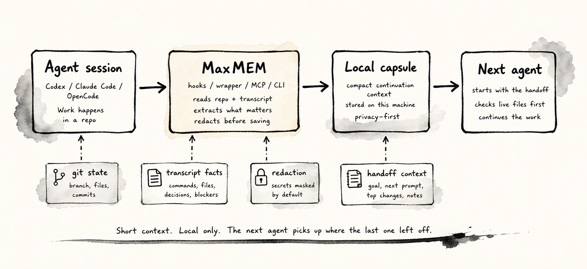
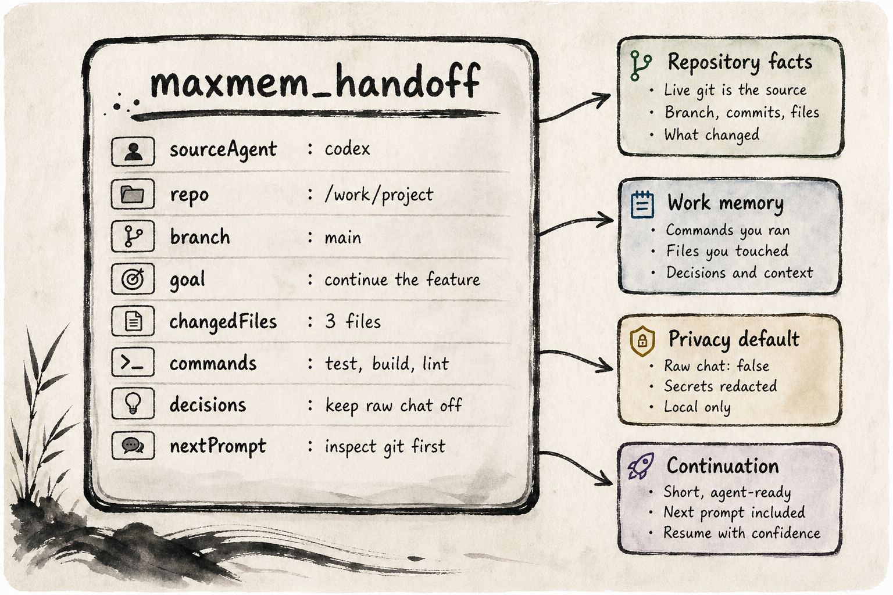

<p align="center">
  
</p>

<h1 align="center">MaxMEM (Maximum Memory)</h1>

<p align="center">
  <strong>Local-first handoff memory for Codex, Claude Code, and OpenCode.</strong>
</p>

<p align="center">
  MaxMEM turns messy agent session endings into compact, private continuation capsules that the next agent can use without importing an entire chat transcript.
</p>

<p align="center">
  <code>Codex hooks</code> - <code>Claude slash commands</code> - <code>OpenCode plugin</code> - <code>MCP server</code> - <code>local capsule viewer</code>
</p>

## Why MaxMEM Exists

AI coding agents are strong inside one session and weak at clean handoffs. When you switch from Codex to Claude Code, restart a terminal, compact context, or open a new agent, the next model usually needs a long recap.

MaxMEM solves that by saving only the work state that matters:

- repo, branch, head, changed files, and recent commits
- transcript-derived commands, file mentions, decisions, and blockers
- the current goal and the next recommended prompt
- source agent and timestamp
- optional redacted raw snippets only when explicitly requested

Raw chat is off by default. The capsule is designed to be short enough for an agent to read and concrete enough for it to continue safely.

## How It Works



1. An agent starts, stops, compacts, or calls a MaxMEM command.
2. MaxMEM reads live git state and the latest known transcript path.
3. The adapter registry selects the right parser for Codex, Claude Code, or OpenCode.
4. The parser extracts commands, files, decisions, blockers, and optional raw snippets.
5. Redaction runs before anything is saved or rendered.
6. The next agent receives a compact handoff through hooks, MCP, slash commands, wrapper injection, or the companion UI.

## Capsule Anatomy



The default capsule is privacy-first:

- `compact`: default, no raw chat, short extracted context
- `standard`: more transcript-derived context, still no raw chat
- `full`: includes redacted raw snippets only when explicitly selected

Use `--raw-chat` or `--verbosity full` only when you actually want raw snippets included.

## Install

Prerequisite: Bun must be available because the package executable is a Bun CLI shim.

```sh
npm install -g maxmem
```

After install, MaxMEM attempts setup automatically. The first normal `maxmem` command also checks setup and repairs missing integration wiring.

Run setup manually only when you want to force reinstall integrations:

```sh
maxmem setup
```

For local development from this repo:

```sh
bun install
bun link
bun run dev status
```

## What Setup Installs

| Target          | What MaxMEM wires                                                       |
| --------------- | ----------------------------------------------------------------------- |
| Codex           | `SessionStart` and `Stop` hooks, MCP config, and a local command plugin |
| Claude Code     | hooks, status line, MCP config, and `/maxmem-*` slash commands          |
| OpenCode        | plugin hooks, MCP config, and `maxmem-*` commands                       |
| Desktop/browser | local companion UI for viewing capsules and launching handoffs          |

Common commands after setup:

```sh
maxmem companion
maxmem launch codex
maxmem launch claude
maxmem launch opencode
maxmem handoff --select
maxmem inspect --capsule
```

## Commands

| Command                               | Purpose                                              |
| ------------------------------------- | ---------------------------------------------------- |
| `maxmem codex [args...]`              | Launch Codex through the MaxMEM wrapper              |
| `maxmem claude [args...]`             | Launch Claude Code through the MaxMEM wrapper        |
| `maxmem opencode [args...]`           | Launch OpenCode through the MaxMEM wrapper           |
| `maxmem handoff`                      | Create and print a compact handoff capsule           |
| `maxmem handoff --copy`               | Copy the capsule on macOS                            |
| `maxmem handoff --select`             | Choose exactly which sections to include             |
| `maxmem handoff --verbosity standard` | Include more extracted context without raw chat      |
| `maxmem handoff --verbosity full`     | Include redacted raw snippets when selected          |
| `maxmem inspect`                      | Inspect latest transcript and capsule state          |
| `maxmem launch <agent>`               | Create a handoff and open an agent in a new terminal |
| `maxmem companion`                    | Open the local capsule viewer and launcher           |
| `maxmem mcp`                          | Run the stdio MCP server                             |
| `maxmem inject`                       | Print latest injectable context for this repo        |
| `maxmem setup`                        | Install or repair integrations                       |
| `maxmem status --verbose`             | Show repository handoff status                       |

## Agent Shortcuts

Claude Code slash commands:

```text
/maxmem
/maxmem-codex
/maxmem-claude
/maxmem-opencode
```

OpenCode commands:

```text
maxmem
maxmem-codex
maxmem-claude
maxmem-opencode
```

Codex receives the same handoff behavior through hooks, MCP, and the local command plugin.

## Companion UI

`maxmem companion` starts a local browser UI for the current repository. It shows recent capsules, the latest rendered handoff, repository status, and launch buttons for Codex, Claude Code, and OpenCode.

It is intentionally local. It does not need a cloud account, hosted database, or remote sync service.

## Architecture

```text
bin/                 Bun executable shim
src/cli/             command routing and option parsing
src/commands/        CLI command entry points
src/companion/       local browser companion server, API, view, CSS, client script
src/core/            adapters, transcript parsing, capsules, git, launch, storage, redaction
src/integrations/    hooks, setup installers, MCP configs, slash command installers
src/mcp/             stdio MCP server and tools
src/ui/              wrapper prompts and terminal UI helpers
tests/               parser, capsule, and redaction tests
assets/readme/       README visuals
```

Key files:

- `src/core/agents.ts`: typed agent adapter registry
- `src/core/transcript.ts`: Codex, Claude Code, and OpenCode transcript parsing
- `src/core/capsule.ts`: capsule creation and injection context
- `src/core/capsuleRender.ts`: rendered handoff formats
- `src/core/store.ts`: local SQLite storage
- `src/integrations/installers.ts`: public setup installer entry point
- `src/mcp/tools.ts`: MCP tool definitions

## Development

```sh
bun run build
npx tsc --noEmit
bun run lint
bun run format
bun test
```

Before committing, run:

```sh
bun run build
npx tsc --noEmit
bun run lint
bun run format
```

There is no committed `dist/cli.js`. The package bin is `bin/maxmem`, and the readable implementation lives in `src`.

## Roadmap

- Add more provider-specific transcript fixtures as formats evolve.
- Harden Linux and Windows terminal launching beyond the current macOS-first path.
- Add richer companion history filters and per-repo capsule search.
- Add package publishing automation once the package name and release flow are final.
