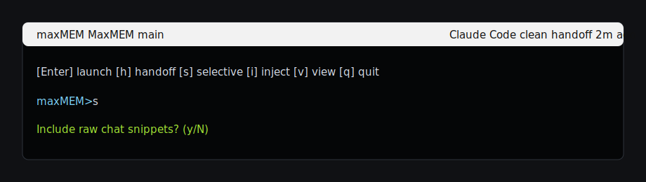

# Demo

## Wrapper

```sh
maxmem claude
```

The wrapper shows a native-feeling terminal bar before launching the agent:



## Selective Handoff

```sh
maxmem handoff --select
```

This prompts for the sections to include:

```text
Include changed files? (Y/n)
Include commands? (Y/n)
Include decisions? (Y/n)
Include blockers? (Y/n)
Include raw chat snippets? (y/N)
```

Raw chat is disabled by default.

## Record A Demo Video

```sh
asciinema rec media/maxmem-demo.cast
maxmem claude
maxmem handoff --select
exit
```

The repo includes the scriptable flow; the actual recording is intentionally left out until the CLI UX stabilizes.
